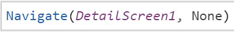
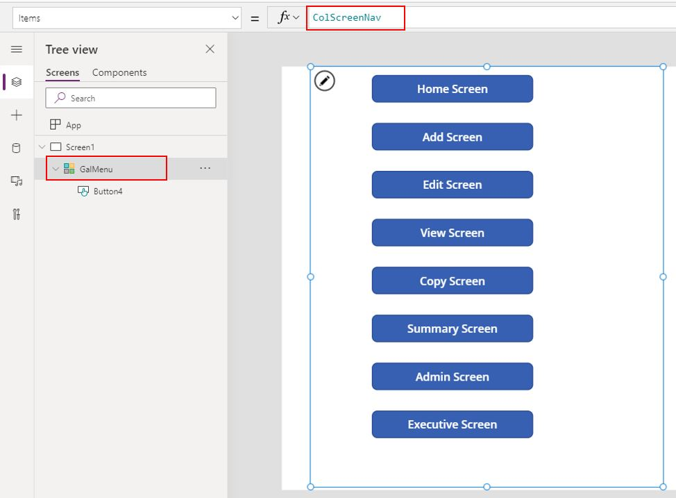

# Power Apps: Canvas App customizations

- [Power Apps: Canvas App customizations](#power-apps-canvas-app-customizations)
  - [Themes](#themes)
  - [Navigation](#navigation)
    - [Power FX](#power-fx)
    - [Gallery](#gallery)

## Themes

A canvas app have a theme that can be changed by another at any time. A theme can be customized but can't be exported so is preferred to maintain the original as another apps of the same brand should have the same color schema. 

## Navigation

### Power FX

A canvas app can hold several screens that can be browsered by the navigate command, that should change the view of the application.

The following image shows the code of PowerFX to achieve the screen switching:

### Gallery

It is posible to navigate the application using an screen that holds a gallery that automatically shows all the buttons related to the different screens available in the app.

